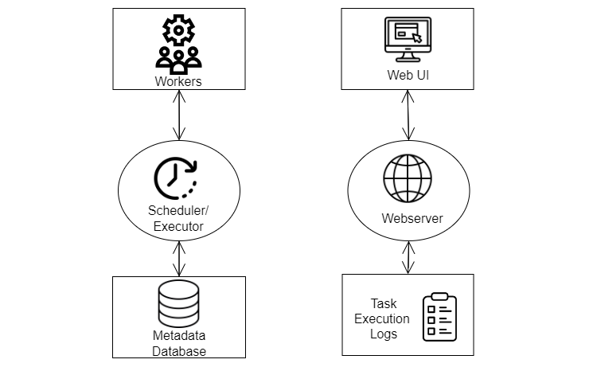

~~~

     ___             ___         _  __            __                    __       
    / _ \_______ ___/ (_)_______(_)/_/ ___    ___/ /__   _  ____ _____ / /__  ___
   / ___/ __/ -_) _  / / __/ __/ / _ \/ _ \  / _  / -_) | |/ / // / -_) / _ \(_-<
  /_/  /_/  \__/\_,_/_/\__/\__/_/\___/_//_/  \_,_/\__/  |___/\_,_/\__/_/\___/___/
                                                                               

~~~
FBID - MUIRST

2022

Laura Fernández Galindo & Patricia Ortuño Otero

# Instructions

>__Note__ You must choose one of two options for creating an Ubuntu 22.04 virtual machine to deploy the scenario. Instructions are provided for a local installation in VirtualBox from an ISO image, and for creating an Ubuntu Desktop via Google Cloud. Then you must choose which execution mode you want, local or containerized with Docker Compose..

- [Create Ubuntu VM on VirtualBox](#crearvmlocal)
- [Create Ubuntu VM on Google Cloud (RECOMMENDED)](#crearvmm)
- [Run the local scenario](#base)
- [Run the scenario with Docker Compose (RECOMMENDED)](#docker)

## Create Ubuntu 22.04 VirtualBox virtual machine <a name="crearvmlocal"></a>.

The following provides instructions for creating a virtual machine with Ubuntu 22.04 in VirtualBox, for deploying the scenario locally.

1. Download [VirtualBox](https://www.virtualbox.org/wiki/Downloads)
2. Create a new machine, with the following features:
     - Tipo: Linux
     - Versión: Ubuntu 22.04 LTS (Jammy Jellyfish) (64 bit)
     - Memoria base (*recomendado*): > 4096 MB
     - Procesadores (*recomendado*): > 2
     - Disk size (*recommended*): > 25 GB
3. To access the Internet: Configuration -> Network -> Adapter1 -> Bridge adapter
4. Start the machine
5. You will be prompted for an ISO image to install. Download [Ubuntu 22.04 Desktop Image (64-bit AMD64)](https://releases.ubuntu.com/22.04/) from the official website.
6. Follow the steps to perform the installation. It is recommended to choose the minimum installation for performance and download speed.
7. When the download is finished, restart the virtual machine. Press *Enter* when prompted.
8. Clone this repository inside the created machine, and access it:
     ````console
     cd
     git clone https://github.com/patriciaOrtuno28/PFINAL-FBID2022.git
     cd PFINAL-FBID2022
     ```

>__Note__ To change the resolution go to Settings -> Displays -> Resolution

## Create Ubuntu 22.04 Google Cloud virtual machine (RECOMMENDED) <a name="createvm"></a>.

1. Log in to [Google Cloud Compute](https://console.cloud.google.com/compute) with your credentials.
2. Create a new instance:
  - Compute Engine -> VM Instances
  - Create instance
    - Zone: europe-southwest1-a
    - Boot disk:
      - Ubuntu 22.04 LTS Minimal (x86-64 architecture)
      - Disk size (*recommended*): > 15 GB
    - Firewall: allow HTTP and HTTPS traffic
3. Clone this repository inside the created machine, and access it:
     ````console
     cd
     git clone https://github.com/patriciaOrtuno28/PFINAL-FBID2022.git
     cd PFINAL-FBID2022
     ```
     >__Note__ If the machine does not recognize the git command, run the following command: `sudo apt-get update && sudo apt install -y git`.
     
4. For the realization of this practice Ubuntu 22.04 Desktop will be used. For this purpose, an automated installation file with the necessary dependencies is provided.

     >__Note__ If you are prompted to restart a service, check both options (using the space bar). When they are checked (a [*] will appear), press Enter.

     >__Warning__ The user to be created is named `fbid`.

     ```console
     chmod 777 desktop.sh
     ```
     Now we can run it:
     ```console
     ./desktop.sh
     ```
     
You will be asked for the following information:
 - Keyboard Layout: (*Spanish*) 84 and 1 respectively.
     - New password: <*your_new_password*>>.
     - As a result of the adduser you will be prompted for a password. Enter the same password you entered previously. The rest of the fields are left empty.

5. To have connectivity inside this machine, let's add a new rule to the Firewall in Google Cloud:
     - Google Cloud -> VPC Network -> Firewall
     - Create a Firewall rule
          - Name: ubuntu-desktop
          - Destination tags: ubuntu-desktop
          - Source IPv4 ranges: 0.0.0.0.0/0
          - Specified protocols and ports: TCP - 4000 and UDP - 4000
     
     You will see the following message on the screen: `The firewall rule "ubuntu-desktop" was successfully created.
6. We have to add this rule to the created instance. To do this, click on the instance name and select Edit. We have to go down to network labels and add `ubuntu-desktop`, inside Network Interfaces.
7. To work with Ubuntu Desktop with graphical interface, instead of the terminal provided by Google Cloud, download [NoMachine](https://downloads.nomachine.com/es/). After completing the installation, you will be prompted to reboot the device.
8. To add a new machine select Add and enter the following data:
     - Name: fbid
     - Host: External IP (*You can see where we have created the instance*)
     - Port: 4000 (*The one that we had opened in the Firewall*)
     - Protocol: NX
9. Click on Connect on the created machine. A warning about the certificate fingerprint will appear. Click OK.
10. Log in with the credentials you created during the desktop.sh file execution.
11. You will see the following message `Cannot detect any running screens Do you want NoMachine to create a new one and proceed to connect to the desktop?` Click Yes.

## Run the local scenario <a name="base"></a>

### Install dependencies 
#### Technologies
- [Python3](https://es.wikipedia.org/wiki/Python)
- [Pip](https://es.wikipedia.org/wiki/Pip_(package_manager))
- [Sbt](https://en.wikipedia.org/wiki/Sbt_(software))
- [MongoDB](https://www.mongodb.com/)
- Spark](https://spark.apache.org/)
- [Scala](https://www.scala-lang.org/)
- [Zookeeper](https://zookeeper.apache.org/)
- [Kafka](https://kafka.apache.org/)

#### Installation
For the realization of this flight prediction practice, a scenario with the technologies mentioned in the previous section previously installed is required. For this purpose, an automated script is provided that will install them, with versions according to the scenario to be executed later.

>__Note__ If you chose the Google Cloud installation, access the base directory `cd` and clone again the project inside the Ubuntu Desktop: `git clone https://github.com/patriciaOrtuno28/PFINAL-FBID2022.git` Access: `cd PFINAL-FBID2022`.

>__Note__ If you are prompted to restart a service, check both options (using the space bar). When they are checked (a [*] will appear), press Enter.

First, permissions must be given to the file to be executed:
```console
chmod 777 VM.sh
```
Now we can run it:
```console
./VM.sh
```
This process may take several minutes as you are installing multiple technologies.

When the installation is complete, you will see the following message in the console:
```
All dependencies have been successfully installed. Please proceed with the execution of the flight-delay predictor scenario.
```

### Initialize the scenario
To initialize the flight-delay (or forward) predictor scenario, a file is provided that automates all the functions mentioned in [Big Data 2019 Practice](https://github.com/ging/practica_big_data_2019).

First, permissions must be provided to the file to be executed:
````console
chmod 777 deploy.sh
```
Now we can execute it:
````console
./deploy.sh
```

>__Warning__ A password will be requested on the screen. It is for the Airflow user.

Once the scenario execution is finished, a message will be displayed on the console with a URL http://localhost:5000/flights/delays/predict_kafka. Through this URL, you can access a web site where you can predict flight delays or delays in flights between an origin and destination, and for a specific date.

To access the Apache Airflow console use the following URL: http://localhost:8080.

(Optional) If you want to observe the status of the database after these predictions, run the following commands:
````console
chmod 777 database.sh
./database.sh
```

>__Note__ To access the indicated URL, if you have chosen the VirtualBox installation method, access it through Firefox. If you have chosen Google Cloud, we have included the Google Chrome installation in VM.sh, so you will be able to locate it in the applications menu of your machine.

#### Apache Airflow

##### What is Apache Airflow?
Apache Airflow is a tool used for service orchestration, allowing the creation, planning and monitoring of workflows. The main applications are: automation of data ingestion, administration tasks and periodic maintenance actions. 

##### What are DAGs?
Airflow works with DAGs (Directed Acyclic Graphs), they are collections of tasks to be executed, each of these tasks are related. These relationships are one-way and acyclic, i.e., they do not allow to go backwards. Each of these tasks are collected in a node. A node is a visual representation of each of the jobs that are being executed. On the other hand, the operators are in charge of determining how each of the tasks should be executed.

##### Airflow architecture
Airflow is composed of a web server that is in charge of managing the requests, i.e. it serves as an API, and a *Scheduler* that carries out the process of understanding, executing and monitoring the tasks described in the DAGs.  An important feature of the Scheduler is that it presents an executor in charge of distributing the tasks and launching the workers. It uses databases such as SQLite to store metadata, users and executions performed. We can run Airflow through programs such as Kubernetes, Sequential, Dask, etc.



##### Why do we use Airflow in this scenario?
We are going to deploy a DAG whose task is to train the data model to make predictions with it. It is set a PySpark task to extract the fields from the database that we are going to use to train the classifier model, and another task for the training event itself.

##### What happens if the task to train the model fails? What is the periodicity of it?
If one task fails, the rest of the tasks will be performed without any problem. This is mainly because each of the tasks are independent of each other. In this case, the task of obtaining the database fields would be executed without error.

It does not have any periodicity. This is because its schedule field has the value of None, which means that it is not scheduled and that its use is exclusively for DAG, i.e., it is only activated externally. If it had the value of @once, the task would only be executed once; if it had the value of @hourly, the task would be executed once every hour. On the other hand, if @daily were valid, the task would be performed once a day at midnight. The same would happen for @weekly, @monthly and @yearly, in which the task would be performed once a week, once a month and once a year respectively, always at midnight.

#### Destroy the scenario (Optional)
In case you wish to revert the installation process of the vue prediction scenario

### Install the dependencies

First, you must provide permissions to the file to be executed:
````console
chmod 777 VMDocker.sh
```
Now we can run it:
````console
./VMDocker.sh
```

>__Note__ It is recommended to run the scenario with the DockerHub images due to latency issues when starting up the scenario. You can access the DockerHub links where we have uploaded our images:

> [Imagen en DockerHub de Spark](https://hub.docker.com/repository/docker/patriciaortuno28/fbid_spark)

> [Imagen en DockerHub de Flask](https://hub.docker.com/repository/docker/patriciaortuno28/fbid_flask)

### Iniciar el escenario con imágenes subidas a DockerHub (RECOMENDADO)

```console
cd docker_compose_dockerhub
sudo docker-compose up -d
```

### Start scenario with images uploaded to DockerHub (RECOMMENDED)

````console
cd docker_compose_dockerhub
sudo docker-compose up -d
```

### Start the scenario with local images

````console
cd docker_compose_local
sudo docker-compose up -d
```

### Accessing the prediction web

To know the IP of the Flask container and access the web service run:
````console
sudo docker inspect flask
```

With that IP access http://ipaddress:5000/flights/delays/predict_kafka.

### Destroy the scenario (Optional)

Run from the Docker Compose folder used to build the scenario:
````console
sudo docker-compose down
sudo docker system prune -a
```

## References

<a href="https://www.flaticon.es/resultados?word=web" target="_blank">Flaticon</a>

